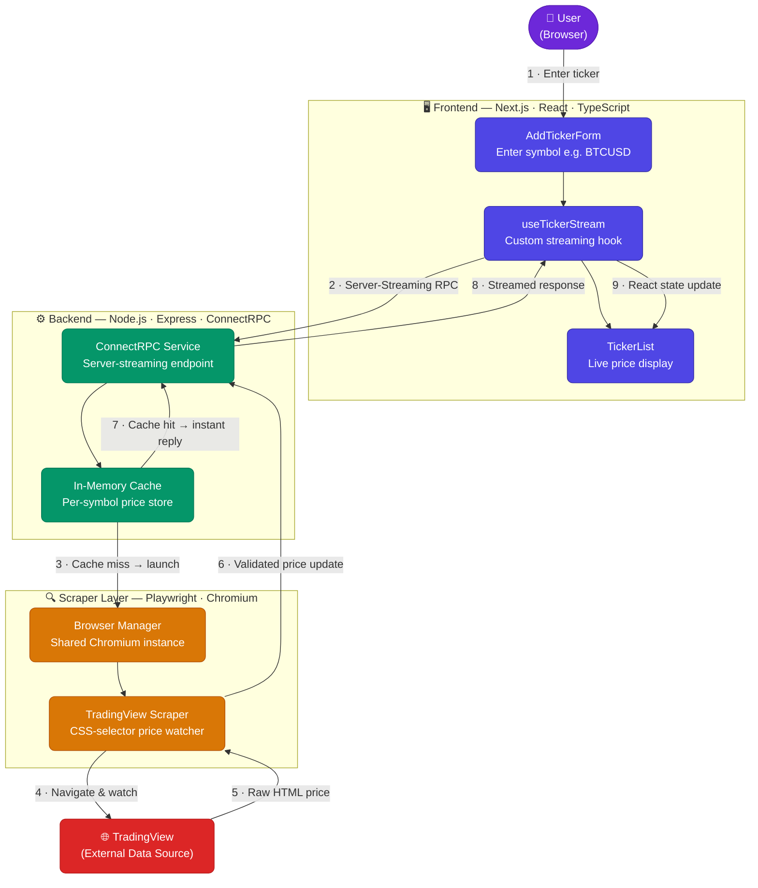

# Crypto Stream - Real-Time Cryptocurrency Price Tracker

## Overview
A modern, full-stack web application that streams real-time cryptocurrency prices directly from TradingView. Built with TypeScript, Next.js, and Node.js, featuring a beautiful UI with dark mode support and responsive design.

## 💡 Problem Statement & Use Cases

### The Problem
Tracking live cryptocurrency prices typically requires manually refreshing exchange websites, paying for premium data feeds, or integrating complex WebSocket APIs. Existing solutions are either too expensive, too complex, or locked behind proprietary platforms — leaving developers and enthusiasts without a simple, open, self-hosted way to access real-time price streams.

**Crypto Stream solves this by:**
- 🔓 **No API keys required** — prices sourced directly from TradingView's public interface
- ⚡ **Zero-latency streaming** — server-push architecture delivers updates the moment they change
- 🧩 **Plug-and-play** — a single script starts the entire stack locally in seconds
- 🌐 **All tickers supported** — any symbol listed on TradingView works out of the box

### Who Is This For?

| Use Case | Description |
|---|---|
| 📈 **Portfolio Trackers** | Build personal dashboards that display live prices for your holdings without any subscription fees |
| 🤖 **Trading Bots** | Feed real-time price data into algorithmic trading or alert systems |
| 📊 **Data Analysts** | Capture live price streams for research, backtesting datasets, or market analysis |
| 🎓 **Learning Projects** | Study real-world streaming architectures (gRPC, Playwright, React) with a working reference implementation |
| 🖥️ **Custom Dashboards** | Embed live crypto prices into home-lab dashboards, Notion widgets, or internal tools |

## 🚀 Key Features

- **Real-time Price Streaming**: Live cryptocurrency prices from TradingView via Playwright automation
- **Modern UI**: Beautiful interface with glass-morphism effects, gradients, and smooth animations
- **Dark/Light Mode**: Toggle between themes with persistent storage and system preference detection
- **Responsive Design**: Optimized for desktop and mobile devices
- **Interactive Elements**: Add/remove tickers with smooth animations and loading states
- **Live Status Indicators**: Real-time connection status and ticker counts
- **Scalable Architecture**: Efficient resource sharing for handling multiple concurrent users
- **Production-Ready**: Health check endpoints, graceful shutdowns, and comprehensive error handling

## 🎬 Live Demo

Experience the real-time cryptocurrency price streaming in action:

<div align="center">
  
  <p><em>Live cryptocurrency price tracking with instant updates and modern UI</em></p>
</div>

## 🏗️ Architecture Overview

### System Components



### Data Flow Architecture

1. **User Input** → Frontend form submits ticker symbol
2. **Subscription** → ConnectRPC establishes server-streaming connection
3. **Cache Check** → Backend checks for existing price data
4. **Scraper Launch** → Playwright opens TradingView page (if not cached)
5. **Price Extraction** → Scraper monitors price changes using CSS selectors
6. **Streaming** → Real-time price updates pushed to all subscribed clients
7. **UI Update** → Frontend receives and displays live price data

## 🛠️ Tech Stack

### Frontend
- **Next.js 14** - React framework with TypeScript
- **React 18** - Component-based UI with hooks
- **ConnectRPC** - Efficient gRPC-like communication
- **Custom Hooks** - `useTickerStream` for real-time data management
- **Theme Context** - Dark/light mode with localStorage persistence

### Backend
- **Node.js** - Runtime environment
- **Express** - Web server framework
- **ConnectRPC** - High-performance RPC communication
- **Playwright** - Browser automation for web scraping
- **TypeScript** - Type-safe development

### Communication
- **Protocol Buffers** - Efficient serialization
- **Server Streaming** - Real-time push notifications
- **HTTP/2** - Modern transport protocol

## 📁 Project Structure

```
├── frontend/                 # Next.js frontend application
│   ├── src/
│   │   ├── components/       # React components
│   │   │   ├── AddTickerForm.tsx
│   │   │   ├── TickerList.tsx
│   │   │   └── ThemeToggle.tsx
│   │   ├── contexts/         # React contexts
│   │   │   └── ThemeContext.tsx
│   │   ├── hooks/            # Custom React hooks
│   │   │   └── useTickerStream.ts
│   │   ├── pages/            # Next.js pages
│   │   │   ├── _app.tsx
│   │   │   └── index.tsx
│   │   └── config/           # Configuration
│   │       └── constants.ts
│   └── gen/proto/            # Generated ConnectRPC code
├── backend/                  # Node.js backend server
│   ├── src/
│   │   ├── services/         # Business logic
│   │   │   └── connectRpcService.ts
│   │   ├── playwright/       # Web scraping
│   │   │   ├── browserManager.ts
│   │   │   └── scraper.ts
│   │   ├── config/           # Configuration
│   │   │   └── constants.ts
│   │   ├── server.ts         # Express server setup
│   │   └── index.ts          # Application entry point
│   └── gen/proto/            # Generated ConnectRPC code
├── proto/                    # Protocol buffer definitions
│   └── ticker.proto
├── shared/                   # Shared TypeScript types
│   └── types.ts
├── run.sh                    # Application startup script
└── package.json              # Workspace configuration
```

## 🚀 Getting Started

### Prerequisites
- Node.js (v18 or higher)
- pnpm package manager
- Bash shell

### Installation & Setup

1. **Clone the repository**
   ```bash
   git clone <repository-url>
   cd crypto-stream-app
   ```

2. **Install dependencies**
   ```bash
   pnpm install --recursive
   ```

3. **Generate protocol buffer code**
   ```bash
   buf generate
   ```

4. **Start the application**
   ```bash
   ./run.sh
   ```

5. **Access the application**
   - Frontend: http://localhost:3000
   - Backend: http://localhost:4000
   - Health check: http://localhost:4000/health
   - Stats endpoint: http://localhost:4000/api/stats

### Development Commands

```bash
# Install all dependencies
pnpm install --recursive

# Start full application
./run.sh

# Start frontend only
pnpm --filter frontend dev

# Start backend only
pnpm --filter backend dev

# Generate protocol buffer code
buf generate
```

## 🔄 End-to-End Data Flow

### 1. User Interaction
- User enters ticker symbol (e.g., "BTCUSD") in the form
- Frontend validates and normalizes the symbol
- `AddTickerForm` component triggers subscription

### 2. Connection Establishment
- `useTickerStream` hook creates ConnectRPC client
- Establishes server-streaming connection to backend
- Generates unique client ID for session tracking

### 3. Backend Processing
- `ConnectRpcService` receives subscription request
- Checks in-memory cache for existing price data
- If cached: immediately streams cached price
- If not cached: launches Playwright scraper

### 4. Web Scraping
- `browserManager` creates shared browser instance
- `scraper` opens TradingView page for the symbol
- Monitors price changes using CSS selectors
- Validates price data against reasonable ranges

### 5. Real-time Streaming
- Price updates broadcast to all subscribed clients
- Backend maintains client-to-symbol mapping
- Automatic cleanup when last client disconnects

### 6. Frontend Updates
- `useTickerStream` receives price updates
- Updates React state with new price data
- `TickerList` component re-renders with live prices
- Smooth animations and loading states

## 🎯 Key Technical Features

### Cache-First Architecture
- **Immediate Response**: Cached prices sent instantly to new subscribers
- **Resource Efficiency**: Single scraper per symbol serves multiple clients
- **Smart Cleanup**: Automatic teardown when no clients remain

### Scalable Browser Management
- **Shared Browser**: Single Chromium instance for all scraping operations
- **Context Pooling**: LRU-based context management (max 16 concurrent)
- **Headed Mode**: Visible browser for debugging and monitoring

### Robust Error Handling
- **Graceful Degradation**: Fallback price detection methods
- **Retry Logic**: Automatic reconnection on connection loss
- **Validation**: Price range validation and symbol normalization

### Modern UI/UX
- **Glass-morphism Design**: Modern blur effects and transparency
- **Responsive Layout**: Mobile-first design with CSS Grid
- **Smooth Animations**: CSS transitions and keyframe animations
- **Accessibility**: Keyboard navigation and screen reader support

## 🔧 Configuration

### Environment Variables

#### Backend Configuration
```bash
PORT=4000                          # Server port
HOST=localhost                     # Server host
POLL_INTERVAL=1000                 # Price polling interval (ms)
PAGE_LOAD_TIMEOUT=30000           # Page load timeout (ms)
DEFAULT_EXCHANGE=BINANCE          # TradingView exchange
TRADINGVIEW_BASE_URL=https://www.tradingview.com/symbols
MIN_PRICE_RANGE=0.01             # Minimum valid price
MAX_PRICE_RANGE=1000000          # Maximum valid price
```

#### Frontend Configuration
```bash
NEXT_PUBLIC_API_URL=http://localhost:4000  # Backend API URL
NEXT_PUBLIC_CURRENCY=USD                   # Currency format
NEXT_PUBLIC_MIN_FRACTION_DIGITS=2          # Min decimal places
NEXT_PUBLIC_MAX_FRACTION_DIGITS=8          # Max decimal places
```

### Supported Tickers
The application supports all valid cryptocurrency symbols available on TradingView, including:
- Major cryptocurrencies: BTCUSD, ETHUSD, ADAUSD, SOLUSD
- Altcoins: DOGEUSD, MATICUSD, DOTUSD, LINKUSD
- Complete list: https://www.tradingview.com/markets/cryptocurrencies/prices-all/

## 🚀 Production Deployment

### Docker Support
```dockerfile
# Multi-stage build for production
FROM node:18-alpine AS base
WORKDIR /app
COPY package*.json ./
RUN npm install -g pnpm
RUN pnpm install --recursive

FROM base AS build
COPY . .
RUN pnpm build

FROM base AS production
COPY --from=build /app/dist ./dist
EXPOSE 3000 4000
CMD ["./run.sh"]
```

### Environment Setup
```bash
# Production environment variables
NODE_ENV=production
PORT=4000
FRONTEND_URL=https://your-domain.com
TRADINGVIEW_BASE_URL=https://www.tradingview.com/symbols
```

## 📊 Monitoring & Observability

### Health Endpoints
- **Health Check**: `GET /health` - Basic service health
- **Stats Endpoint**: `GET /api/stats` - Real-time system statistics
- **ConnectRPC Metrics**: Built-in connection and subscription tracking

### Logging
- **Structured Logs**: JSON-formatted logs with timestamps
- **Log Rotation**: Automatic log file management
- **Debug Information**: Detailed scraping and connection logs

## 🤝 Contributing

1. Fork the repository
2. Create a feature branch: `git checkout -b feature/new-feature`
3. Commit changes: `git commit -am 'Add new feature'`
4. Push to branch: `git push origin feature/new-feature`
5. Submit a pull request

## 📄 License

This project is open source and available under the MIT License.

## 🙏 Acknowledgments

- **TradingView** - For providing real-time cryptocurrency data
- **Playwright** - For reliable browser automation
- **ConnectRPC** - For efficient real-time communication
- **Next.js** - For the modern React framework